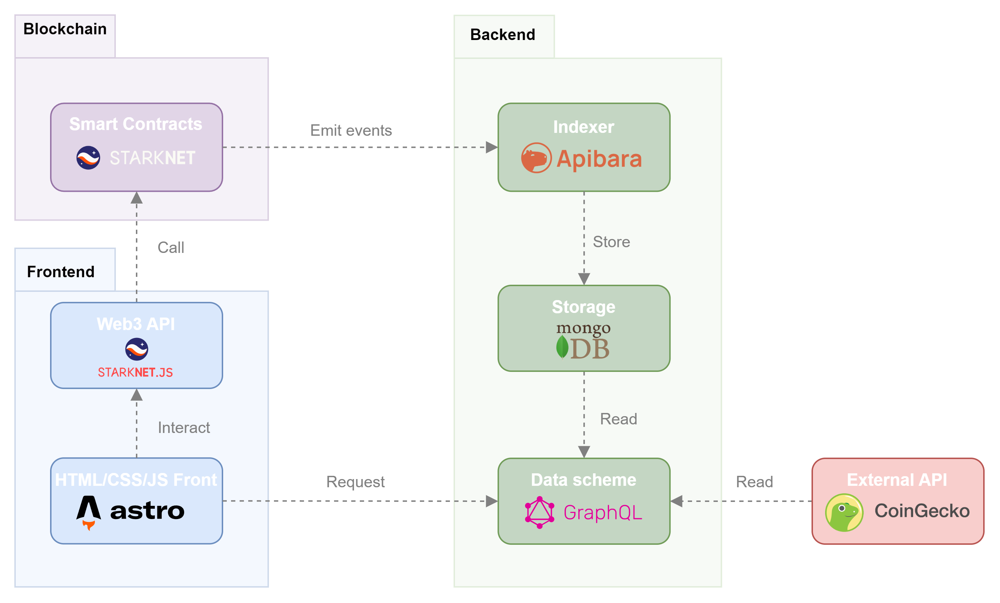

# Moloch on Starknet indexer

Table of Contents

- [About](#about)
- [Warning](#warning)
- [Technical Architecure Overview](#technical-architecture-overview)

## About

>**Moloch on Starknet indexer** is an Apibara based indexer managing the streaming, the storage and the querying of Moloch on Starknet events and data.

It is based on [Apibara python indexer Template](https://github.com/apibara/python-indexer-template), which enables to quickly start indexing smart contracts events with Apibara.

Hence this repository uses [Apibara](https://github.com/apibara/apibara) to index the web3 data.

## Warning

It is work in progress, do not use in production.

> As Moloch on Starknet Smart Contracts, which are currently developed on Cairo 0.10, will be ported on Cairo 1.0. at regenesis, the indexer will be udpated accordingly.

## Technical Architecture Overview

Indexing is managed through Apibara which is a framework and protocol to build composable streams of Web3 data.

The contracts emit several events that are read and transformed by the Apibara Indexer, stored into mongoDB and queryable through GraphQL.

  

>The list of events emitted by the Cairo Smart Contracts can be found [here](https://dao-docs.quadratic-labs.com/moloch-on-starknet/technical-architecture/events-list)

>An overview of the indexed data structure can be found [here](https://dao-docs.quadratic-labs.com/moloch-on-starknet/technical-architecture/indexed-data-structure)

>The list of the transformations operated through GraphQL can be found [here](https://dao-docs.quadratic-labs.com/moloch-on-starknet/technical-architecture/graphql-api)
